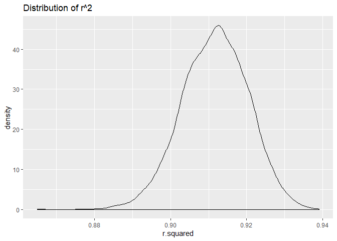

p8105\_hw6\_scl2160
================
Sam Loewen
11/18/2019

# Problem 1

Cleaning data:

``` r
bw = read.csv("./data/birthweight.csv") %>% 
  janitor::clean_names() %>% 
  mutate(babysex = as.factor(babysex),
         frace = as.factor(frace),
         malform = as.factor(malform),
         mrace = as.factor(mrace),
         menarche = ifelse(menarche == 0, "", menarche),
         fincome = as.numeric(ifelse(fincome == 0, "", fincome)),
         wtgain = as.numeric(ifelse(wtgain < 0, "", wtgain)),
         menarche = as.numeric(menarche))
```

## Plotting model one

I wanted to see the effect of income and race on birthweight, in the the
absense of medical/health/physical indicators. For that reason I chose
income, father’s race, and mother’s
race.

``` r
model_1 = lm(bwt ~ frace + mrace + fincome + frace*fincome + mrace*fincome, data = bw)

bw %>% 
  add_predictions(model_1) %>% 
  add_residuals(model_1) %>% 
  ggplot(aes(x = pred, y = resid)) +
  geom_point()+
 geom_line(aes(y = pred), color = "orange") +
    labs(
    title = "Predicted birthweight vs residuals",
    x = "predicted birthweight",
    y = "residuals"
  )
```

    ## Warning: Removed 1 rows containing missing values (geom_point).

    ## Warning: Removed 1 rows containing missing values (geom_path).

<!-- -->

models 2 and 3:

``` r
model_2 = lm(bwt ~ blength + gaweeks, data = bw)

model_3 = lm(bwt ~ bhead + blength + babysex + bhead*blength + bhead*babysex + blength*babysex + bhead*blength*babysex, data = bw)
```

## Testing model fits

``` r
rmse(model_1, bw)
```

    ## [1] 487.7493

``` r
rmse(model_2, bw)
```

    ## [1] 333.1023

``` r
rmse(model_3, bw)
```

    ## [1] 287.4692

``` r
cv_df = 
  crossv_mc(bw, 100) 

cv_df = 
  cv_df %>% 
  mutate(model_1 = map(train, ~lm(bwt ~ fincome + mrace + frace, data = bw)), 
         model_2 = map(train, ~lm(bwt ~ blength + gaweeks, data = bw)),
         model_3 = map(train, ~lm(bwt ~ bhead + blength + babysex + bhead*blength + bhead*babysex + blength*babysex + bhead*blength*babysex, data = bw))) %>% 
  mutate(rmse_1 = map2_dbl(model_1, test, ~rmse(mode = .x, data = .y)),
         rmse_2 = map2_dbl(model_2, test, ~rmse(mode = .x, data = .y)),
         rmse_3 = map2_dbl(model_3, test, ~rmse(mode = .x, data = .y)))

cv_df %>% 
  select(starts_with("rmse")) %>% 
  pivot_longer(
    everything(),
    names_to = "model", 
    values_to = "rmse",
    names_prefix = "rmse_") %>% 
  mutate(model = fct_inorder(model)) %>% 
  ggplot(aes(x = model, y = rmse)) + geom_boxplot() +
  labs(
    title = "Cross validation comparison of models"
  )
```

<!-- -->

Model 3 is the best\!

# Problem 2

``` r
weather_df = 
  rnoaa::meteo_pull_monitors(
    c("USW00094728"),
    var = c("PRCP", "TMIN", "TMAX"), 
    date_min = "2017-01-01",
    date_max = "2017-12-31") %>%
  mutate(
    name = recode(id, USW00094728 = "CentralPark_NY"),
    tmin = tmin / 10,
    tmax = tmax / 10) %>%
  select(name, id, everything())
```

    ## Registered S3 method overwritten by 'crul':
    ##   method                 from
    ##   as.character.form_file httr

    ## Registered S3 method overwritten by 'hoardr':
    ##   method           from
    ##   print.cache_info httr

    ## file path:          C:\Users\saman\AppData\Local\rnoaa\rnoaa\Cache/ghcnd/USW00094728.dly

    ## file last updated:  2019-09-26 10:27:26

    ## file min/max dates: 1869-01-01 / 2019-09-30

Model:

``` r
lm(tmax ~ tmin, data = weather_df) %>% 
  broom::tidy()
```

    ## # A tibble: 2 x 5
    ##   term        estimate std.error statistic   p.value
    ##   <chr>          <dbl>     <dbl>     <dbl>     <dbl>
    ## 1 (Intercept)     7.21    0.226       31.8 3.81e-107
    ## 2 tmin            1.04    0.0170      61.2 2.98e-193

Distribution of log(β^0 ∗ β^1):

``` r
weather_df %>% 
  modelr::bootstrap(n = 5000) %>% 
  mutate(
    models = map(strap, ~lm(tmax ~ tmin, data = .x)),
    result = map(models, broom::tidy)) %>% 
  select(-strap, -models) %>% 
  unnest(result) %>% 
  group_by(.id) %>% 
  summarize(log_coef = sum(log(estimate))) %>% 
  ggplot(aes(x = log_coef)) + geom_density() +
  labs(
    title = "Distribution of log(β^0 ∗ β^1)",
    x = "log(β^0 ∗ β^1)",
    y = "desnsity"
  )
```

<!-- -->

The estimates of log(β^0 ∗ β^1) appear normally distributed.

Distribution of r^2:

``` r
weather_df %>% 
  modelr::bootstrap(n = 5000) %>% 
  mutate(
    models = map(strap, ~lm(tmax ~ tmin, data = .x)),
    result = map(models, broom::glance)) %>% 
  select(-strap, -models) %>% 
  unnest(result) %>% 
  ggplot(aes(x = r.squared)) + geom_density() +
  labs(title = "Distribution of r^2")
```

<!-- -->

The r^2 estimates are fairly normally distributed, but slightly left
skewed.

Confidence interval of log(β^0 ∗ β^1):

``` r
weather_df %>% 
  modelr::bootstrap(n = 5000) %>% 
  mutate(
    models = map(strap, ~lm(tmax ~ tmin, data = .x)),
    result = map(models, broom::tidy)) %>% 
  select(-strap, -models) %>% 
  unnest(result) %>% 
  group_by(.id) %>% 
  summarize(log_coef = sum(log(estimate))) %>% 
  summarize(low_int = quantile(log_coef, 0.025), up_int = quantile(log_coef, .975))
```

    ## # A tibble: 1 x 2
    ##   low_int up_int
    ##     <dbl>  <dbl>
    ## 1    1.97   2.06

Confidence interval of r^2:

``` r
weather_df %>% 
  modelr::bootstrap(n = 5000) %>% 
  mutate(
    models = map(strap, ~lm(tmax ~ tmin, data = .x)),
    result = map(models, broom::glance)) %>% 
  select(-strap, -models) %>% 
  unnest(result) %>% 
  summarize(low_int = quantile(r.squared, 0.025), up_int = quantile(r.squared, .975))
```

    ## # A tibble: 1 x 2
    ##   low_int up_int
    ##     <dbl>  <dbl>
    ## 1   0.894  0.928
