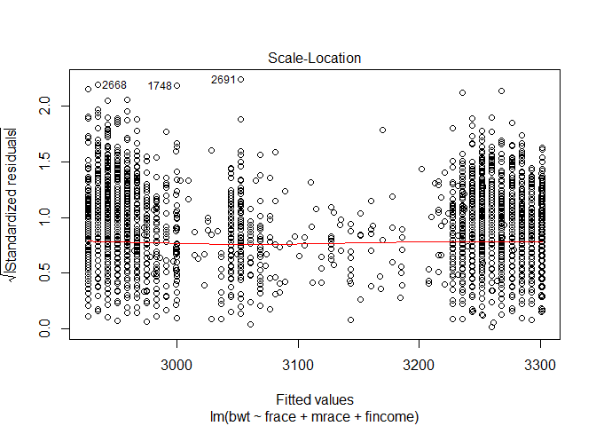

p8105\_hw6\_scl2160
================
Sam Loewen
11/18/2019

``` r
bw = read.csv("./data/birthweight.csv") %>% 
  janitor::clean_names() %>% 
  mutate(babysex = as.factor(babysex),
         frace = as.factor(frace),
         malform = as.factor(malform),
         mrace = as.factor(mrace),
         menarche = ifelse(menarche == 0, "", menarche),
         fincome = as.numeric(ifelse(fincome == 0, "", fincome)),
         wtgain = as.numeric(ifelse(wtgain < 0, "", wtgain)),
         menarche = as.numeric(menarche))

head (bw)
```

    ##   babysex bhead blength  bwt delwt fincome frace gaweeks malform menarche
    ## 1       2    34      51 3629   177      35     1    39.9       0       13
    ## 2       1    34      48 3062   156      65     2    25.9       0       14
    ## 3       2    36      50 3345   148      85     1    39.9       0       12
    ## 4       1    34      52 3062   157      55     1    40.0       0       14
    ## 5       2    34      52 3374   156       5     1    41.6       0       13
    ## 6       1    33      52 3374   129      55     1    40.7       0       12
    ##   mheight momage mrace parity pnumlbw pnumsga    ppbmi ppwt smoken wtgain
    ## 1      63     36     1      3       0       0 26.27184  148      0     29
    ## 2      65     25     2      0       0       0 21.34485  128      0     28
    ## 3      64     29     1      0       0       0 23.56517  137      1     11
    ## 4      64     18     1      0       0       0 21.84508  127     10     30
    ## 5      66     20     1      0       0       0 21.02642  130      1     26
    ## 6      66     23     1      0       0       0 18.60030  115      0     14

Propose a regression model for birthweight. This model may be based on a
hypothesized structure for the factors that underly birthweight, on a
data-driven model-building process, or a combination of the two.
Describe your modeling process and show a plot of model residuals
against fitted values – use add\_predictions and add\_residuals in
making this plot.

Compare your model to two others:

## three models

``` r
model_1 = lm(bwt ~ frace + mrace + fincome, data = bw)

model_2 = lm(bwt ~ blength + gaweeks, data = bw)

model_3 = lm(bwt ~ bhead + blength + babysex + bhead*blength + bhead*babysex + blength*babysex + bhead*blength*babysex, data = bw)
```

## plotting model one

``` r
plot(model_1)
```

<!-- --><!-- --><!-- --><!-- -->

``` r
bw %>% 
  add_predictions(model_1) %>% 
  add_residuals(model_1) %>% 
  ggplot(aes(x = fincome, y = bwt)) +
  geom_point()+
 geom_line(aes(y = pred), color = "orange")
```

    ## Warning: Removed 1 rows containing missing values (geom_point).

    ## Warning: Removed 1 rows containing missing values (geom_path).

<!-- -->

## testing model fits

``` r
rmse(model_1, bw)
```

    ## [1] 488.0628

``` r
rmse(model_2, bw)
```

    ## [1] 333.1023

``` r
rmse(model_3, bw)
```

    ## [1] 287.4692

``` r
cv_df = 
  crossv_mc(bw, 100) 

cv_df = 
  cv_df %>% 
  mutate(model_1 = map(train, ~lm(bwt ~ fincome + mrace + frace, data = bw)), 
         model_2 = map(train, ~lm(bwt ~ blength + gaweeks, data = bw)),
         model_3 = map(train, ~lm(bwt ~ bhead + blength + babysex + bhead*blength + bhead*babysex + blength*babysex + bhead*blength*babysex, data = bw))) %>% 
  mutate(rmse_1 = map2_dbl(model_1, test, ~rmse(mode = .x, data = .y)),
         rmse_2 = map2_dbl(model_2, test, ~rmse(mode = .x, data = .y)),
         rmse_3 = map2_dbl(model_3, test, ~rmse(mode = .x, data = .y)))

cv_df %>% 
  select(starts_with("rmse")) %>% 
  pivot_longer(
    everything(),
    names_to = "model", 
    values_to = "rmse",
    names_prefix = "rmse_") %>% 
  mutate(model = fct_inorder(model)) %>% 
  ggplot(aes(x = model, y = rmse)) + geom_violin()
```

<!-- -->

Make this comparison in terms of the cross-validated prediction error;
use crossv\_mc and functions in purrr as appropriate.

Note that although we expect your model to be reasonable, model building
itself is not a main idea of the course and we don’t necessarily expect
your model to be “optimal”.

# Problem 2

``` r
weather_df = 
  rnoaa::meteo_pull_monitors(
    c("USW00094728"),
    var = c("PRCP", "TMIN", "TMAX"), 
    date_min = "2017-01-01",
    date_max = "2017-12-31") %>%
  mutate(
    name = recode(id, USW00094728 = "CentralPark_NY"),
    tmin = tmin / 10,
    tmax = tmax / 10) %>%
  select(name, id, everything())
```

    ## Registered S3 method overwritten by 'crul':
    ##   method                 from
    ##   as.character.form_file httr

    ## Registered S3 method overwritten by 'hoardr':
    ##   method           from
    ##   print.cache_info httr

    ## file path:          C:\Users\saman\AppData\Local\rnoaa\rnoaa\Cache/ghcnd/USW00094728.dly

    ## file last updated:  2019-09-26 10:27:26

    ## file min/max dates: 1869-01-01 / 2019-09-30

The boostrap is helpful when you’d like to perform inference for a
parameter / value / summary that doesn’t have an easy-to-write-down
distribution in the usual repeated sampling framework. We’ll focus on a
simple linear regression with tmax as the response and tmin as the
predictor, and are interested in the distribution of two quantities
estimated from these data:

r<sup>2 log(β</sup>0∗β^1)

``` r
boot_sample = function(df) {
  sample_frac(df, replace = TRUE)
}

boot_sample(weather_df)
```

    ## # A tibble: 365 x 6
    ##    name           id          date        prcp  tmax  tmin
    ##    <chr>          <chr>       <date>     <dbl> <dbl> <dbl>
    ##  1 CentralPark_NY USW00094728 2017-12-09   117   1.7  -1  
    ##  2 CentralPark_NY USW00094728 2017-01-28     0   3.9   1.1
    ##  3 CentralPark_NY USW00094728 2017-05-24    10  20.6  13.3
    ##  4 CentralPark_NY USW00094728 2017-08-15   114  23.3  20  
    ##  5 CentralPark_NY USW00094728 2017-06-21     0  28.3  21.7
    ##  6 CentralPark_NY USW00094728 2017-08-05    76  25.6  20.6
    ##  7 CentralPark_NY USW00094728 2017-08-03     0  30.6  20  
    ##  8 CentralPark_NY USW00094728 2017-09-20     0  26.1  21.7
    ##  9 CentralPark_NY USW00094728 2017-07-09     0  27.2  19.4
    ## 10 CentralPark_NY USW00094728 2017-04-13     0  18.3   8.9
    ## # ... with 355 more rows

``` r
boot_sample(weather_df) %>% 
  ggplot(aes(x = tmin, y = tmax)) + 
  geom_point(alpha = .5) +
  stat_smooth(method = "lm")
```

<!-- -->

``` r
boot_straps = 
  data_frame(
    strap_number = 1:5000,
    strap_sample = rerun(5000, boot_sample(weather_df))
  )
```

    ## Warning: `data_frame()` is deprecated, use `tibble()`.
    ## This warning is displayed once per session.

``` r
bootstrap_results = 
  boot_straps %>% 
  mutate(
    models = map(strap_sample, ~lm(tmax ~ tmin, data = .x) ),
    results = map(models, broom::tidy)) %>% 
  select(-strap_sample, -models) %>% 
  unnest() %>% 
  group_by(term) %>% 
  summarize(boot_se = sd(estimate))
```

    ## Warning: `cols` is now required.
    ## Please use `cols = c(results)`

``` r
bootstrap_results %>% 
  knitr::kable(digits = 3)
```

| term        | boot\_se |
| :---------- | -------: |
| (Intercept) |    0.248 |
| tmin        |    0.017 |

Use 5000 bootstrap samples and, for each bootstrap sample, produce
estimates of these two quantities. Plot the distribution of your
estimates, andw describe these in words. Using the 5000 bootstrap
estimates, identify the 2.5% and 97.5% quantiles to provide a 95%
confidence interval for r^2 and log(β<sup>0∗β</sup>1). Note:
broom::glance() is helpful for extracting r^2 from a fitted regression,
and broom::tidy() (with some additional wrangling) should help in
computing log(β<sup>0∗β</sup>1).
